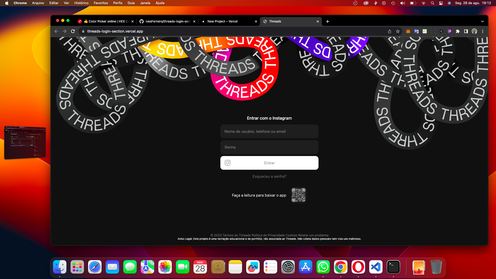

# Threads - Recriação Educacional e de Portfólio

## Descrição do Projeto

Este projeto é uma recriação educacional e de portfólio da interface de login do aplicativo Threads, associado ao Instagram. A finalidade principal é demonstrar habilidades de desenvolvimento web e design através da recriação fiel da página de login do Threads. O projeto não tem intenção de coletar dados pessoais nem é destinado a uso malicioso.

## Capturas de Tela

## Funcionalidades

- **Entrar com o Instagram:** Os usuários podem inserir suas informações de login do Instagram para acessar suas contas.
- **Esqueceu a Senha:** Um link é fornecido para redirecionar os usuários à página de redefinição de senha do Instagram.
- **QR Code:** Um QR code é fornecido como uma opção para os usuários baixarem o aplicativo Threads.

## Instruções de Uso

1. Abra o arquivo `index.html` em um navegador da web.
2. Preencha seu nome de usuário, telefone ou email no campo "Nome de usuário, telefone ou email".
3. Insira sua senha no campo "Senha".
4. Clique no botão "Entrar" para efetuar o login.
5. Se necessário, clique no link "Esqueceu a senha?" para redefinir sua senha no Instagram.
6. Para baixar o aplicativo Threads, faça a leitura do QR code fornecido.

## Tecnologias Utilizadas

- HTML5
- CSS3
- SASS/SCSS

## Estrutura de Arquivos

- `index.html`: Contém a estrutura da página de login.
- `styles/main.css`: Folha de estilos CSS para estilização da página.
- `assets/`: Diretório contendo imagens utilizadas no projeto.

## Hospedagem

O projeto está hospedado no Vercel. Você pode acessá-lo [aqui](https://threads-login-section.vercel.app/).

## Aviso Legal

Este projeto é uma recriação educacional e de portfólio, não associada ao Threads. Não coleta dados pessoais nem visa uso malicioso. Para obter mais informações sobre os Termos de Uso e Política de Privacidade do Threads, consulte os links fornecidos no rodapé da página.
